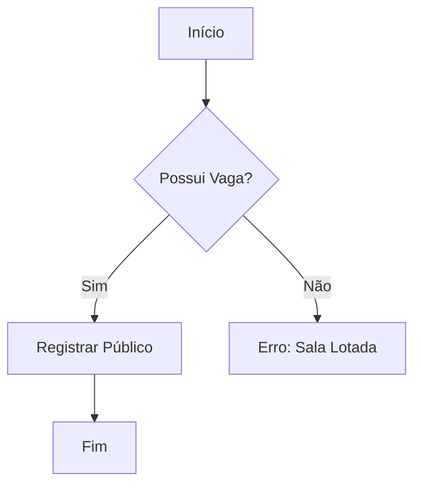
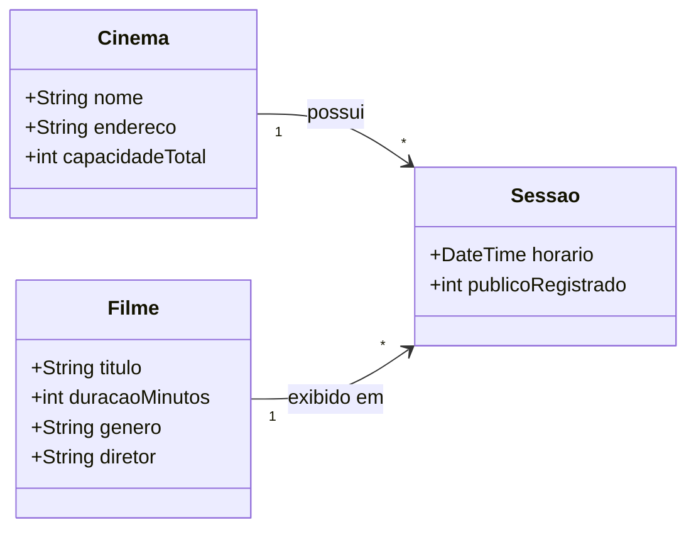
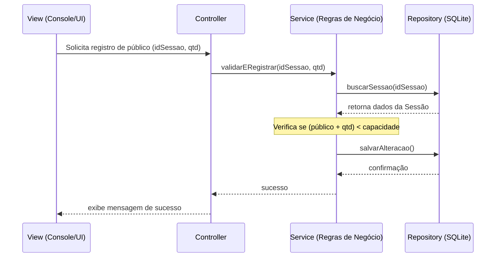

# Sistema de Gestão de Cinema

## 📋 Requisitos
- [link para os requisitos](./docs/requisitos.md)

## 📊 Modelagem (UML)

```mermaid 
useCaseDiagram
    actor "Funcionário/Admin" as Admin
    actor "Espectador" as Esp

    Admin --> (Cadastrar Filme/Sessão)
    Admin --> (Registrar Público Diário)
    Admin --> (Gerar Relatórios de Público)
    
    Esp --> (Consultar Filmes e Elenco)
    Esp --> (Verificar Horários de Sessões)
```



## 💻 Como Executar
1. Clone o repositório
2. Execute o comando `python main.py` ou `java Main`

