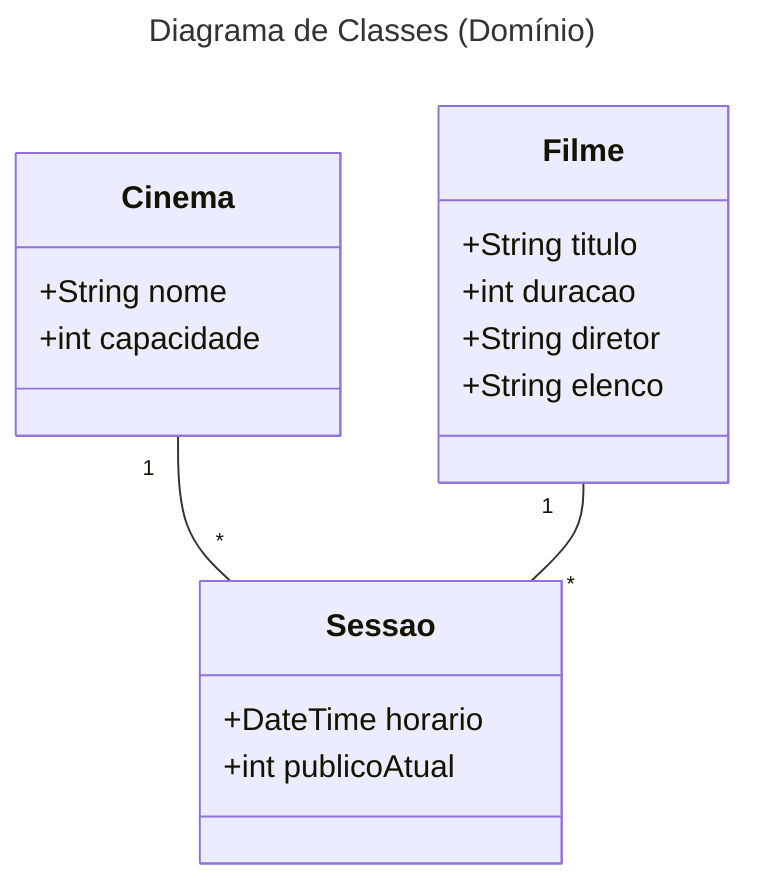
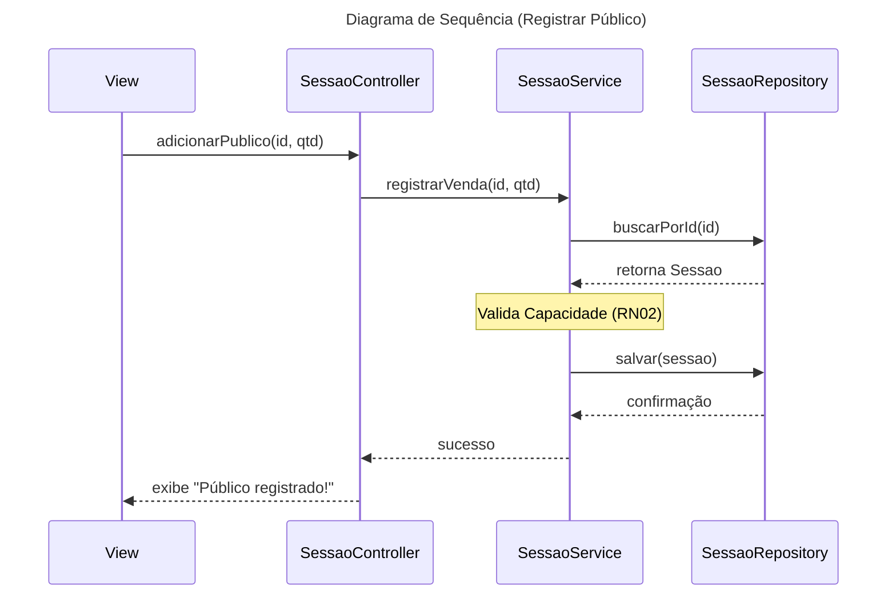

# Sistema de Gestão de Cinema

## 📋 Requisitos
- [link para os requisitos](./docs/requisitos.md)

## 📊 Modelagem (UML)

## 💻 Como Executar
1. Clone o repositório
2. Execute o comando `python main.py` ou `java Main`

